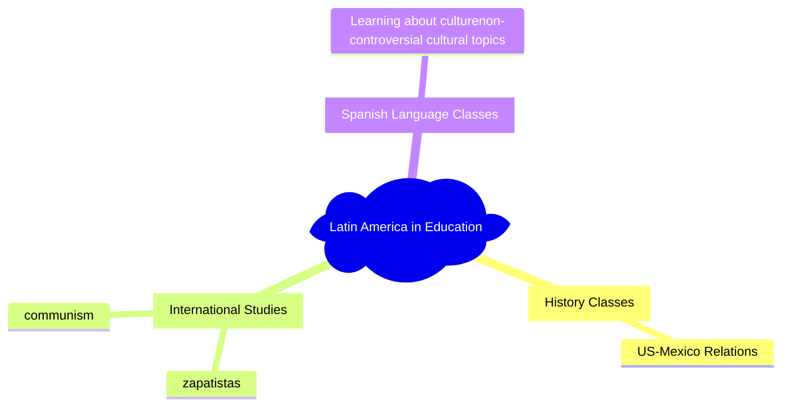

# What's this class?

It's about the role that {language, music, film, art} play in {politics, culture, etc.} between the US and lam.

"From good neigbor policy to national secuity threat"

# Thought Question

In academic settings, where would you expect to learn about Latin america?

## Class Discussion
We generally learn about Latin America in three main areas:
1. Spanish language classes
	- Are generally focused on Spain, as most spanish classes were founded by / influenced by the RAE (Real Academia España)
	- Cover grammar, communication, and non-controversial cultural topics
2. History classes
	- In US History, Latin America is covered through the perspective of International Relations. Namely, war and crises with mexico.
	- In World History, Latin america is covered as a part of a broader category, such as communism.
3. REI COURSES
	* Latin America is covered as a group of "Third World" countries

We were then shown a slide of Coco, Encanto, Drugs, and soldiers

# Syllabus
- 3 Absences, Attendance is mandatory
- No textbook, nothing to purchase / buy
- Exams are online, you don't necessarily need to be present, but this may change
- 2-3 "Article Reflections", where we read an academic article, and then write a response
- Final Essay, as opposed to a Final Exam
# Homework for Friday
[[J002 - South America Map]]
Fill out countries, their capital cities, major geographical landmarks, and languages.
